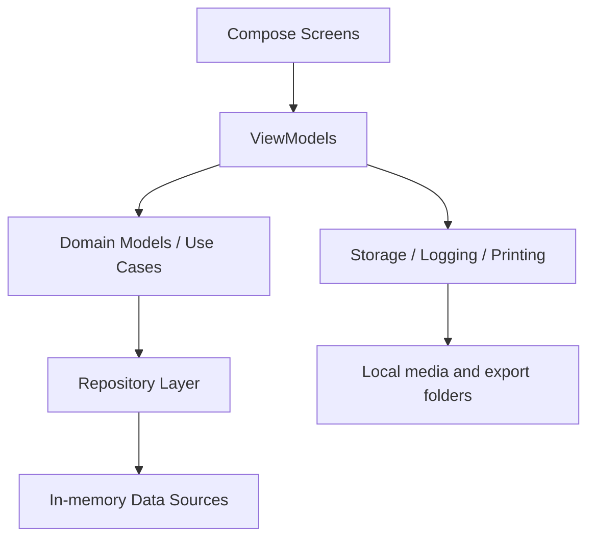

# KawaiiPB Architecture Overview

Last updated: 2026-08-15

## Summary

KawaiiPB is a feature-oriented Android app that uses Jetpack Compose and a ViewModel-driven flow for the photo booth session. The current architecture is intentionally practical: it separates user-facing screens from app services and domain models without enforcing a deep Clean Architecture layer boundary.

## Architectural style

- Feature-first package organization
- Compose UI for the screen layer
- ViewModels for state and event flow
- Repository contracts and use cases for app logic
- Services for storage, logging, and print output

## High-level data flow

## Main feature groups

### Presentation layer

- `feature/landing/` contains landing and admin unlock flows.
- `feature/flow/` contains the kiosk flow and assignment logic.
- `feature/admin/` contains admin dashboard and settings screens.
- `feature/printing/` contains final render and export logic.

### State layer

- `FlowViewModel.kt` owns the main state transitions for the kiosk flow.
- `FlowUiState.kt` is the central model for stage and user state.
- `FlowScreen.kt` is a coordinator that connects state to stage-specific composables.

### Service layer

- `KawaiiStorageService` handles save paths, export files, and public folder initialization.
- `SessionLogService` records session events for diagnostics.
- `PrintComposer` and related helpers produce the final render output.

## Flow responsibilities

The flow feature currently owns the most complexity:

- camera mode selection
- capture actions and countdown states
- photo assignment transforms and slots
- strip layout and template selection
- sticker placement and rotation
- preview and print preparation

Because the flow state is centralized, this is the primary area to refactor carefully.

## Current strengths

- Clear feature boundaries
- Simple dependency injection via `KawaiiPbDependencies`
- Reusable design system for Compose screens
- Easy to extend incrementally without a full rewrite

## Current risks

- `FlowViewModel` and `FlowUiState` are dense and stateful
- UI and transition logic are still fairly coupled
- The app would benefit from more test coverage around stage transitions and print rendering

## Recommended direction

- Keep `FlowScreen.kt` as a thin coordinator
- split stage-specific UI into smaller composables
- isolate pure state updates into helper functions
- keep all file and media operations behind the storage service boundary
