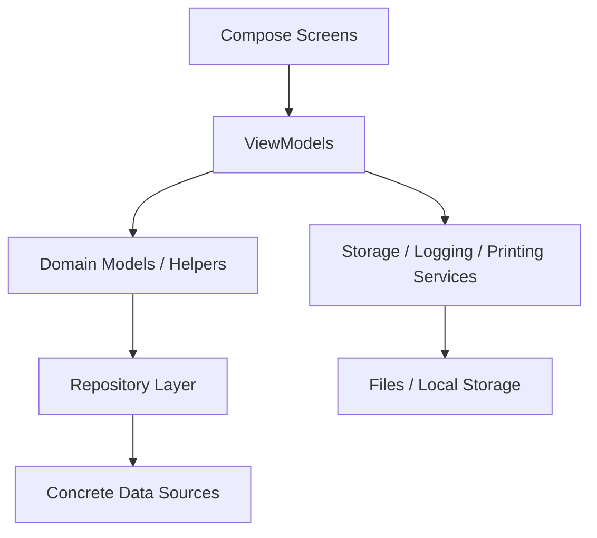

# KawaiiPB Architecture Overview

Last updated: 2026-08-12

## Summary

KawaiiPB uses a feature-first, Compose-driven architecture with a thin UI coordinator, ViewModel state management, domain models, and small service/repository boundaries.

## Architectural Style

- Presentation layer built with Jetpack Compose
- ViewModel-driven state and event handling
- Domain models for kiosk flow state
- Repository abstraction for data access
- Service layer for storage, logging, and file IO

This is a pragmatic layered architecture rather than a strict Clean Architecture implementation.

## High-Level Data Flow

## Flow System Architecture

### Presentation

- `FlowScreen.kt` routes stage content and user actions
- Extracted stage files hold focused composables
- Shared helpers provide layout previews and reusable UI controls

### State

- `FlowViewModel.kt` owns the kiosk flow state machine
- `FlowUiState` is the single source of truth for the screen
- User intent is expressed as callbacks and ViewModel actions

### Data and Services

- `KawaiiStorageService` manages capture files, exports, and print file paths
- `SessionLogService` records key session events
- Printing helpers build print-ready output from captured frames and templates

## Rendering Pipeline

1. Screen receives state from the ViewModel.
2. Compose reads the current state and selects the active stage UI.
3. Stage composables render camera, assignment, templates, preview, or print status.
4. Image helpers decode photos and assets when needed.
5. Print helpers compose the final bitmap or PDF representation for output.

## Photo Pipeline

1. CameraX captures a photo to a local file.
2. Storage service assigns the file to the session.
3. Flow state records the captured frame path.
4. Preview composables load the bitmap for display.
5. Print composer prepares the same image for print export.

## Template and Layout Pipeline

1. Template manifests and layout files are loaded from assets.
2. Template JSON is parsed through the manifest schema docs in `docs/json-schemas/`.
3. Layout JSON is parsed into the internal strip layout model.
4. Assignment and preview screens render the selected background and overlay.
5. Captured frames are composited into the layout slots.

## Strengths

- Clear separation between flow state and UI
- Compose-friendly state updates
- Small service layer for IO-heavy tasks
- Incremental refactoring is practical because responsibilities are already feature-based

## Current Risks

- Large legacy files can reaccumulate if helper ownership is not enforced
- Shared image loading can become a performance bottleneck without caching
- UI preview code can become repetitive if not kept in dedicated helper files

## Recommended Direction

- Keep `FlowScreen.kt` as the coordinator only
- Keep capture, assignment, and shared widgets in their own files
- Keep bitmap and asset loading centralized
- Keep ViewModel helper logic out of the UI layer
